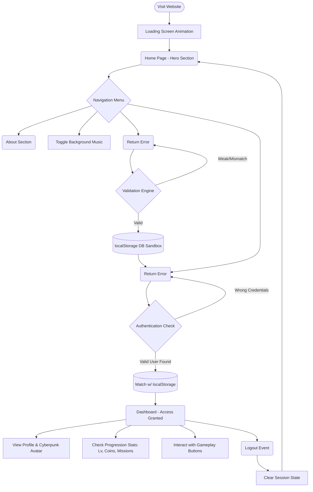

# Neon City Gaming 🌆

A modern, responsive, GTA-inspired cyberpunk gaming website frontend. Featuring dark neon aesthetics, an ambient music toggle, custom AI-generated backgrounds and avatars, and full page structures (Landing, About, Login, Register, Dashboard).

## 📖 Project Description

Neon City Gaming is built to simulate the frontend experience of a modern web-based gaming hub. It is heavily inspired by the neon-lit, gritty, action-packed aesthetics popularized by the Cyberpunk genre and the Grand Theft Auto series. 

The project operates as a **Single Page Application (SPA)** using pure Vanilla JavaScript to handle dynamic page switching without ever reloading the browser window. It comes fully equipped with a functional client-side mock authentication system. This means that users can register an account, visually track password strength, receive validation feedback, log into the portal, and unlock a secure dashboard—all running locally in your browser memory natively.

---

## 🗺️ Application Work Flow & Architecture 

Below is the user journey map and architectural flow of the application:



### Flow Breakdown:
1. **Initialization:** The browser loads `index.html`. A loader ring is visible for 1.5 seconds while assets prep behind the scenes.
2. **Navigation:** The user clicks navigation links (`nav-link`). The JavaScript intercepts these clicks (preventDefault), hides the currently active section, and adds `.active` to the targeted display section.
3. **Registration:** When a user types in their password, a real-time JS event triggers listening to string values, adjusting the CSS width and color of the strength bar. On successful submit, the credentials are encapsulated in a JSON object and cached into the browser's persistent `localStorage`.
4. **Authentication:** The terminal login intercepts the submitted form username/email. Next, it reaches into the LocalStorage cache. If the identity exists and matches the password cipher, it toggles the DOM layout to hide Login/Register tabs and unlocks the Dashboard and Logout buttons.
5. **Dashboard Interaction:** Serves as the central hub where the simulated stats are drawn, proving the user successfully verified terminal access.

---

## 🚀 Features

- **Immersive Cyberpunk Theme**: Dark mode styled using glowing CSS neon aesthetics (`#ff007f`, `#00f0ff`, `#b537f2`).
- **Single Page Application Flow**: Smooth transitions between the Landing, About, Login, Register, and Dashboard sections using Vanilla JavaScript logic.
- **Client-side Authentication Simulator**: Test run the entire flow! Contains a mock database using `localStorage` to simulate account creation and user login.
- **Dynamic Register Screen**: Includes an interactive password strength indicator and form validation for matching passwords.
- **Dashboard Hub**: Displays mock user information, player rank, stats (Level, Coins, Missions), and game action buttons.
- **Audio Experience**: Embedded ambient background music with an interactive Navbar toggle for immersion.

## 🛠️ Tech Stack 

- **HTML5**: Semantic layout.
- **CSS3**: Custom CSS variables, Flexbox/Grid for mobile responsiveness, keyframe animations, glowing box-shadows, and glassmorphism (backdrop filters).
- **JavaScript (Vanilla)**: DOM manipulation, mock state management (`localStorage`), and basic password evaluation logic.

## 💻 Local Setup & Run 

This project requires zero backend dependencies, framework installations, or compilations!

1. Clone or extract this project folder to your machine.
2. Navigate to the directory containing the project files.
3. Simply double-click `index.html` to open it in your default web browser (Chrome, Edge, Firefox, Brave).
   - Alternatively, open the folder in an editor like VS Code and use the **Live Server** extension for a more seamless development experience.

## 📁 Project Structure

```text
noen_game/
├── assets/
│   ├── avatar.png          # Generated visual for dashboard profile
│   └── hero_bg.png         # Generated immersive background image
├── index.html              # The core HTML application & templates 
├── script.js               # Frontend UI logic, auth logic & routing
├── style.css               # Implementation of the complete cyberpunk theme
└── README.md               # Documentation and project details
```

### Breakdowns
- **`index.html`**: The core application container, featuring the nested templates for all pages.
- **`style.css`**: Contains the entire cyberpunk styling system.
- **`script.js`**: Handles all the frontend UI interactions, form validations, and routing logic.
- **`assets/`**: Contains custom image art (the city background and the profile avatar).

## 🎨 UI Preview Highlights

- **Glitch & Glow Elements**: Title fonts and interactive buttons utilize layered `box-shadow` and `text-shadow` for that futuristic action feel.
- **Loader Animation**: Custom spinning CSS loader built with borders on initialization to match the UI scheme.
- **Stats Grid**: Dashboard items neatly showcased using a responsive CSS Grid.
