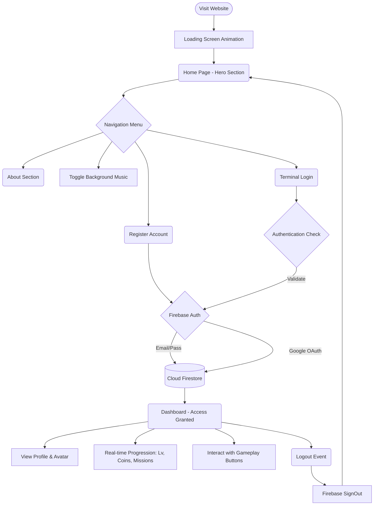

# Neon City Gaming 🌆

A modern, responsive, GTA-inspired cyberpunk gaming website. Featuring dark neon aesthetics, an ambient music toggle, custom AI-generated backgrounds, and full page structures (Landing, About, Login, Register, Dashboard) powered by **Firebase**.

## 📖 Project Description

Neon City Gaming is an immersive frontend experience for a modern web-based gaming hub. It is heavily inspired by the neon-lit, gritty aesthetics popularized by the Cyberpunk genre and the Grand Theft Auto series.

The project operates as a **Single Page Application (SPA)** using Vanilla JavaScript to handle dynamic page switching. It is fully integrated with **Firebase** for cloud-based authentication and persistent data storage. Users can register, log in (including Google OAuth), and track their progression stats (Level, Coins, Missions) which are saved securely in **Google Cloud Firestore**.

---

## 🗺️ Application Work Flow & Architecture 

Below is the user journey map and architectural flow of the application:



### Flow Breakdown:
1. **Initialization:** The browser loads `index.html`. A loader ring is visible while Firebase SDKs initialize and check for existing auth sessions.
2. **Navigation:** The JavaScript intercepts menu clicks, hides active sections, and reveals the targeted page without reloading.
3. **Registration/Login:** User credentials are processed via `firebase/auth`. On registration, a new profile document is automatically created in `firebase/firestore`.
4. **Data Persistence:** Unlike simple mockups, all player stats are saved in the cloud. Refreshing the page keeps you logged in and preserves your "Street Cred."
5. **Dashboard Interaction:** Serves as the central hub where user data is pulled dynamically from Firestore in real-time.

---

## 🚀 Features

- **Immersive Cyberpunk Theme**: Dark mode styled using glowing CSS neon aesthetics (`#ff007f`, `#00f0ff`, `#b537f2`).
- **Real Backend Integration**: Uses **Firebase Authentication** for secure login and **Cloud Firestore** for data persistence.
- **Social Login**: Integrated Google Sign-In for quick access to the underground network.
- **Dynamic Dashboard**: Displays live user information, player rank, and stats (Level, Coins, Missions) fetched from the cloud.
- **Password Security**: Includes a real-time password strength indicator during registration.
- **Audio Experience**: Embedded ambient background music with an interactive Navbar toggle for immersion.

## 🛠️ Tech Stack 

- **Frontend**: HTML5, CSS3 (Custom variables, Flexbox/Grid, Animations).
- **Logic**: JavaScript (Vanilla ES6 Modules).
- **Backend-as-a-Service**: 
    - **Firebase Auth**: User management and OAuth.
    - **Cloud Firestore**: NoSQL Database for user stats.
    - **Firebase Analytics**: Interaction tracking.

## 💻 Local Setup & Run 

Because this project uses ES6 Modules (`type="module"`), it must be served via a web server to avoid CORS issues.

1. Clone or extract this project folder.
2. Open the folder in VS Code.
3. Use the **Live Server** extension (right-click `index.html` -> "Open with Live Server").
4. Alternatively, use any local server:
   ```bash
   npx serve .
   ```

## 📁 Project Structure

```text
Neon_City_Gaming/
├── assets/
│   ├── avatar.png          # Generated visual for dashboard profile
│   └── hero_bg.png         # Generated immersive background image
├── firebase-config.js      # Firebase SDK initialization and credentials
├── index.html              # Core HTML structure and page templates
├── script.js               # Frontend UI logic, Auth, and Firestore interactions
├── style.css               # Implementation of the complete cyberpunk theme
└── README.md               # Documentation and project details
```

### Breakdowns
- **`firebase-config.js`**: Centralized configuration for connecting to the Google Cloud backend.
- **`index.html`**: The single-page container hosting all application views.
- **`style.css`**: The design system, animations, and neon styling.
- **`script.js`**: The main controller handling navigation, authentication, and state management.

## 🎨 UI Preview Highlights

- **Glitch & Glow Elements**: Title fonts and interactive buttons utilize layered `box-shadow` and `text-shadow`.
- **Loader Animation**: Custom spinning CSS loader built with borders on initialization.
- **Stats Grid**: Dashboard items neatly showcased using a responsive CSS Grid.
